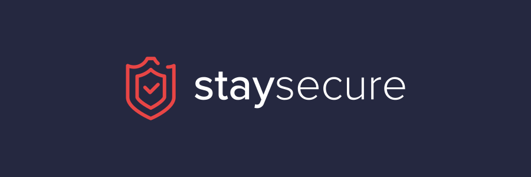
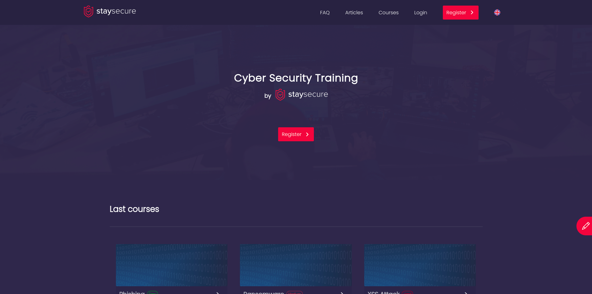
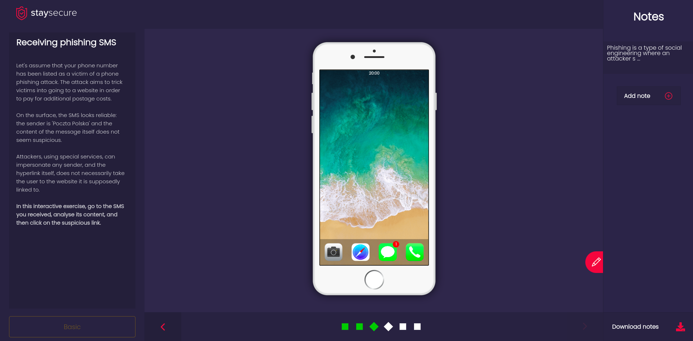
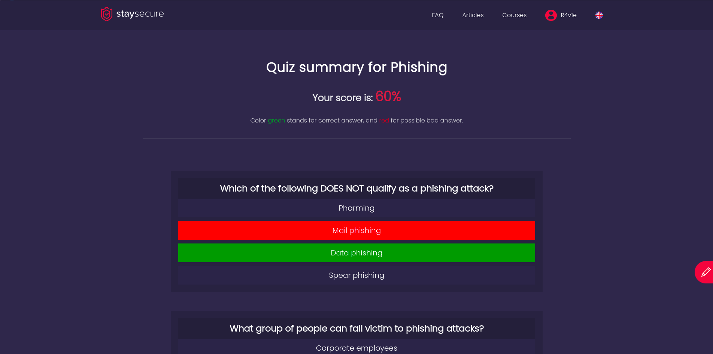
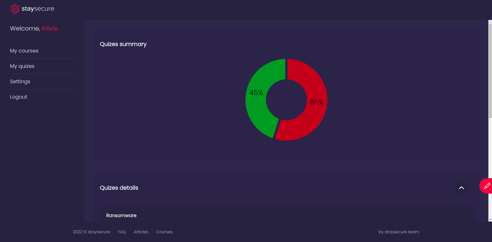

<a name="readme-top"></a>

<br />
<div align="center">
  <a href="https://github.com/benmotyka/staysecure_front">
    
  </a>
  <h1 align="center">staysecure.pl</h1>
  <h3 align="center">Cybersecurity courses</h3>
  <h5 align="center">Front-end App</h5>
  <p align="center">
    <a href="https://staysecure.pl"><strong>Explore the page »</strong></a>
    <a href="https://github.com/benmotyka/staysecure_front/issues">Report Bug</a>
    ·
    <a href="https://github.com/benmotyka/staysecure_front/issues">Request Feature</a>
  </p>
</div>

<!-- TABLE OF CONTENTS -->
<details>
  <summary>Table of Contents</summary>
  <ol>
    <li>
      <a href="#about-the-project">About The Project</a>
      <ul>
        <li><a href="#built-with">Built With</a></li>
      </ul>
    </li>
    <li>
      <a href="#getting-started">Getting Started</a>
      <ul>
        <li><a href="#prerequisites">Prerequisites</a></li>
        <li><a href="#installation">Installation</a></li>
      </ul>
    </li>
    <li><a href="#roadmap">Roadmap</a></li>
    <li><a href="#contributing">Contributing</a></li>
    <li><a href="#contact">Contact</a></li>
  </ol>
</details>

<!-- ABOUT THE PROJECT -->

## About The Project

Staysecure is a web application that educates users in the field of cybersecurity. The user has the option of creating an account and basic operations related to it (password reminder, password reset). In the process of creating an account, the user declares the "level of advancement" - basic or advanced, that affects the type of slides included in the course.

The main goal of the website is to allow user to take part in the interactive courses with elements of virtual reality. The courses are divided into three levels: easy, medium and hard. The topics of the courses are related to the current threats on the web, such as: Phishing, Keylogger, Ransomware, DDoS, SQL Injection, XSS attacks. Course consist of slides, often interactive, and a description of the current slide. Interactive slides require user interaction to continue the course. The slides describe in detail the source of the threat, its course and potential protection methods.

After completing the course, the user takes a quiz that summarizes the learning outcomes. The user can take part in many courses and save relevant content in the notes panel, as well as can comment on and rate the courses. Comments and the average grade of the course are presented to users before the course starts.

<details>
	<summary>View screenshots</summary>






</details>

### Built With

* [![React][react.js]][react-url]
* [![styled-components][styled-components]][styled-components-url]

<p align="right">(<a href="#readme-top">back to top</a>)</p>

<!-- GETTING STARTED -->

## Getting Started

### Prerequisites

- [Node.js](https://nodejs.org/en/download/)
- [staysecure server](https://github.com/benmotyka/staysecure_api)

### Installation

1. Clone this repo
   ```sh
   git clone https://github.com/benmotyka/staysecure_front.git
   ```
2. Install NPM packages
   ```sh
   npm install
   ```
3. Run server (please refer to [https://github.com/benmotyka/staysecure_api](https://github.com/benmotyka/staysecure_api)) for more details
4. Create `.env` file and enter:
   ```
   NODE_PATH=src/
   API_URL=<server_url> // eg: http://localhost:8081
   ```
5. Run app
   ```sh
   npm start
   ```

<p align="right">(<a href="#readme-top">back to top</a>)</p>

<!-- ROADMAP -->

## Roadmap

- [x] Add notes panel
- [x] Add comments and rates for courses
- [x] Add FAQ
- [x] Add basic e2e tests
- [x] Multi-language Support
  - [x] English
  - [x] Polish
- [x] Frontend adjustments
- [ ] Add comments under articles
- [ ] Mobile view for courses

See the [open issues](https://github.com/benmotyka/staysecure_front/issues) for a full list of proposed features (and known issues).

<p align="right">(<a href="#readme-top">back to top</a>)</p>

<!-- CONTRIBUTING -->

## Contributing

Contributions are what make the open source community such an amazing place to learn, inspire, and create. Any contributions you make are **greatly appreciated**.

If you have a suggestion that would make this better, please fork the repo and create a pull request. You can also simply open an issue with the tag "enhancement".
Thanks again!

1. Fork the Project
2. Create your Feature Branch (`git checkout -b feature/AmazingFeature`)
3. Commit your Changes (`git commit -m 'Add some AmazingFeature'`)
4. Push to the Branch (`git push origin feature/AmazingFeature`)
5. Open a Pull Request

<p align="right">(<a href="#readme-top">back to top</a>)</p>


## Contact

Ben Motyka - [LinkedIn](https://www.linkedin.com/in/ben-motyka-97a729240/) - benmotykax@gmail.com

Project Link: [https://github.com/benmotyka/staysecure_front](https://github.com/benmotyka/staysecure_front)

<p align="right">(<a href="#readme-top">back to top</a>)</p>
