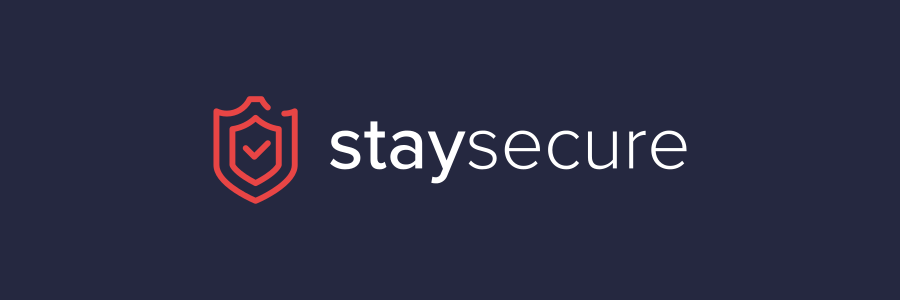

<!-- source: https://github.com/othneildrew/Best-README-Template -->
<a name="readme-top"></a>

<!-- PROJECT LOGO -->
<br />
<div align="center">
  <a href="https://github.com/othneildrew/Best-README-Template">
    
  </a>

  <h3 align="center">Staysecure</h3>

  <p align="center">
    Cybersecurity courses 
    <br />
    <a href="https://staysecure.pl"><strong>Explore the page »</strong></a>
    <br />
    <br />
    ·
    <a href="https://github.com/benmotyka/staysecure_front/issues">Report Bug</a>
    ·
    <a href="https://github.com/benmotyka/staysecure_front/issues">Request Feature</a>
  </p>
</div>


<!-- TABLE OF CONTENTS -->
<details>
  <summary>Table of Contents</summary>
  <ol>
    <li>
      <a href="#about-the-project">About The Project</a>
      <ul>
        <li><a href="#built-with">Built With</a></li>
      </ul>
    </li>
    <li>
      <a href="#getting-started">Getting Started</a>
      <ul>
        <li><a href="#prerequisites">Prerequisites</a></li>
        <li><a href="#installation">Installation</a></li>
      </ul>
    </li>
    <li><a href="#roadmap">Roadmap</a></li>
    <li><a href="#contributing">Contributing</a></li>
    <li><a href="#contact">Contact</a></li>
  </ol>
</details>


<!-- ABOUT THE PROJECT -->
## About The Project
todo
<p align="right">(<a href="#readme-top">back to top</a>)</p>


### Built With

* [![React][React.js]][React-url]

<p align="right">(<a href="#readme-top">back to top</a>)</p>


<!-- GETTING STARTED -->
## Getting Started
### Prerequisites

* [Node.js](https://nodejs.org/en/download/)

### Installation

1. Clone this repo
   ```sh
   git clone https://github.com/benmotyka/staysecure_front.git
   ```
2. Install NPM packages
   ```sh
   npm install
   ```
3. Clone and run API repo (please refer to [https://github.com/benmotyka/staysecure_api](https://github.com/benmotyka/staysecure_api)) for more details
4. Create `.env` file and enter:
   ```
   NODE_PATH = src/
   API_URL=http://localhost:8081
   ```

<p align="right">(<a href="#readme-top">back to top</a>)</p>


<!-- ROADMAP -->
## Roadmap

- [x] Add FAQ
- [x] Add basic e2e tests
- [x] Multi-language Support
    - [x] English
    - [x] Polish
- [ ] Frontend adjustments
- [ ] Add comments under articles
- [ ] Mobile view for courses

See the [open issues](https://github.com/benmotyka/staysecure_front/issues) for a full list of proposed features (and known issues).

<p align="right">(<a href="#readme-top">back to top</a>)</p>

<!-- CONTRIBUTING -->
## Contributing

Contributions are what make the open source community such an amazing place to learn, inspire, and create. Any contributions you make are **greatly appreciated**.

If you have a suggestion that would make this better, please fork the repo and create a pull request. You can also simply open an issue with the tag "enhancement".
Thanks again!

1. Fork the Project
2. Create your Feature Branch (`git checkout -b feature/AmazingFeature`)
3. Commit your Changes (`git commit -m 'Add some AmazingFeature'`)
4. Push to the Branch (`git push origin feature/AmazingFeature`)
5. Open a Pull Request

<p align="right">(<a href="#readme-top">back to top</a>)</p>


<!-- LICENSE
## License

Distributed under the MIT License. See `LICENSE.txt` for more information.

<p align="right">(<a href="#readme-top">back to top</a>)</p>
 -->


## Contact

Ben Motyka - [@your_twitter](https://twitter.com/your_username) - benmotykax@gmail.com

Project Link: [https://github.com/benmotyka/staysecure_front](https://github.com/benmotyka/staysecure_front)

<p align="right">(<a href="#readme-top">back to top</a>)</p>


<p align="right">(<a href="#readme-top">back to top</a>)</p>


<!-- MARKDOWN LINKS & IMAGES -->
<!-- https://www.markdownguide.org/basic-syntax/#reference-style-links -->
[product-screenshot]: images/screenshot.png
[React.js]: https://img.shields.io/badge/React-20232A?style=for-the-badge&logo=react&logoColor=61DAFB
[React-url]: https://reactjs.org/